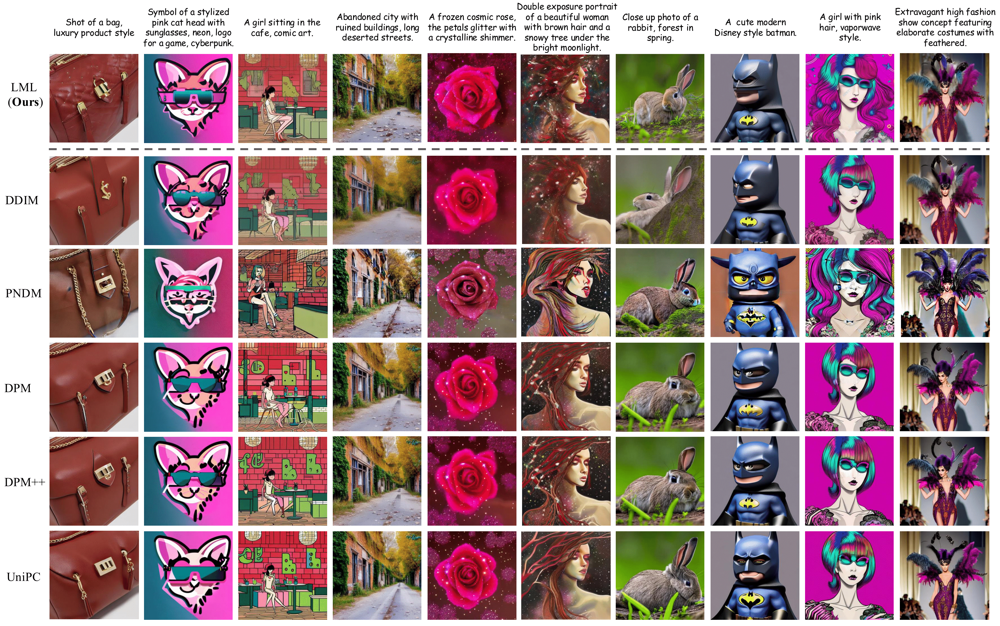
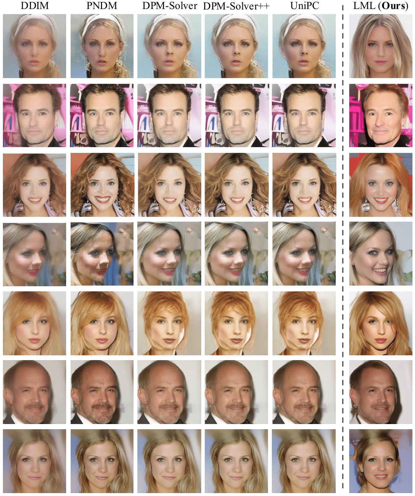
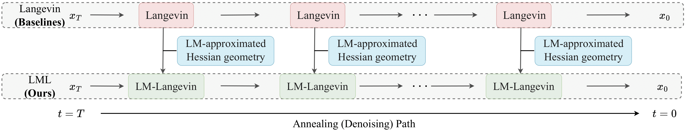
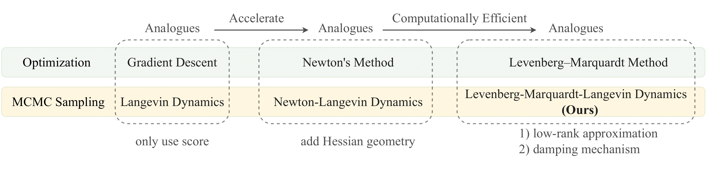

<div align="center">

# Improve Diffusion Image Generation Quality using Levenberg-Marquardt-Langevin

This repository is the official implementation of the **Arxiv 2025** paper:
_"Unleashing High-Quality Image Generation in Diffusion Sampling Using Second-Order Levenberg-Marquardt-Langevin"_ 


> **Fangyikang Wang<sup>1,2</sup>, Hubery Yin<sup>2</sup>, Lei Qian<sup>1</sup>, Yinan Li<sup>1</sup>, Shaobin Zhuang<sup>3,2</sup>, Huminhao Zhu<sup>1</sup>, Yilin Zhang<sup>1</sup>, Yanlong Tang<sup>4</sup>, Chao Zhang<sup>1</sup>, Hanbin Zhao<sup>1</sup>, Hui Qian<sup>1</sup>, Chen Li<sup>2</sup>**
>
> <sup>1</sup>Zhejiang University <sup>2</sup>WeChat Vision, Tencent Inc <sup>3</sup>Shanghai Jiao Tong University <sup>4</sup>Tencent Lightspeed Studio

[](https://www.arxiv.org/abs/2505.24222)&nbsp;
[](https://opensource.org/licenses/MIT)&nbsp;





</div>

## The intuition of our LML diffusion sampler


> **Schematic comparison** between our LML method and baselines. While previous works mainly focus on intriguing designs along the annealing path to improve diffusion sampling, they leave operations at specific noise levels to be performed using first-order Langevin. Our approach proposes to leverage the Levenberg-Marquardt approximated Hessian geometry to guide the Langevin update to be more accurate.



> The relation between optimization algorithms and MCMC sampling algorithms. We initially wanted to develop a diffusion sampler utilizing Hessian geometry, following the path of Newton-Langevin dynamics.
However, this approach proved to be highly computationally expensive within the DM context.
Drawing inspiration from the Levenberg-Marquardt method used in optimization, our method incorporates low-rank approximation and damping techniques. This enables us to obtain the Hessian geometry in a computationally affordable manner. Subsequently, we use this approximated Hessian geometry to guide the Langevin updates.

## 👨🏻‍💻 Run the code 
### 1) Get start

* Python 3.8.12
* CUDA 11.7
* NVIDIA A100 40GB PCIe
* Torch 2.0.0
* Torchvision 0.14.0

Please follow **[diffusers](https://github.com/huggingface/diffusers)** to install diffusers.

### 2) Run
first, please switch to the root directory.

#### CIFAR-10 sampling
[TODO]
#### CelebA-HQ sampling
[TODO]
#### SD-15, SD-2b COCO-14 sampling
[TODO]


## 🪪 License
This project is licensed under the MIT License - see the [LICENSE](LICENSE.txt) file for details.

## 📩 Contact me
My e-mail address:
```
wangfangyikang@zju.edu.cn
```